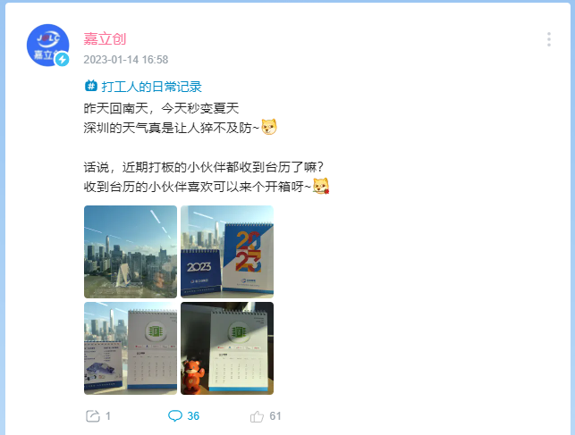
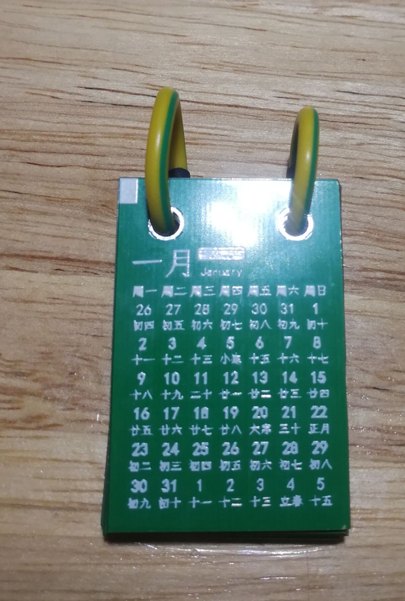
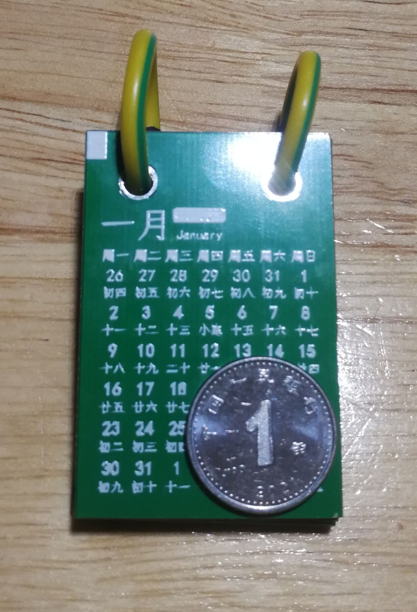
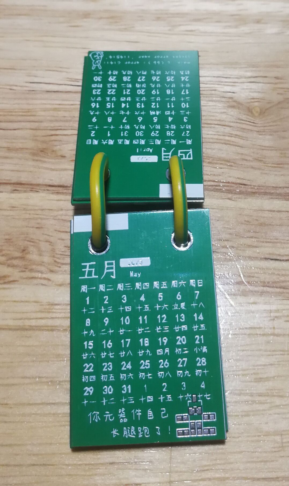
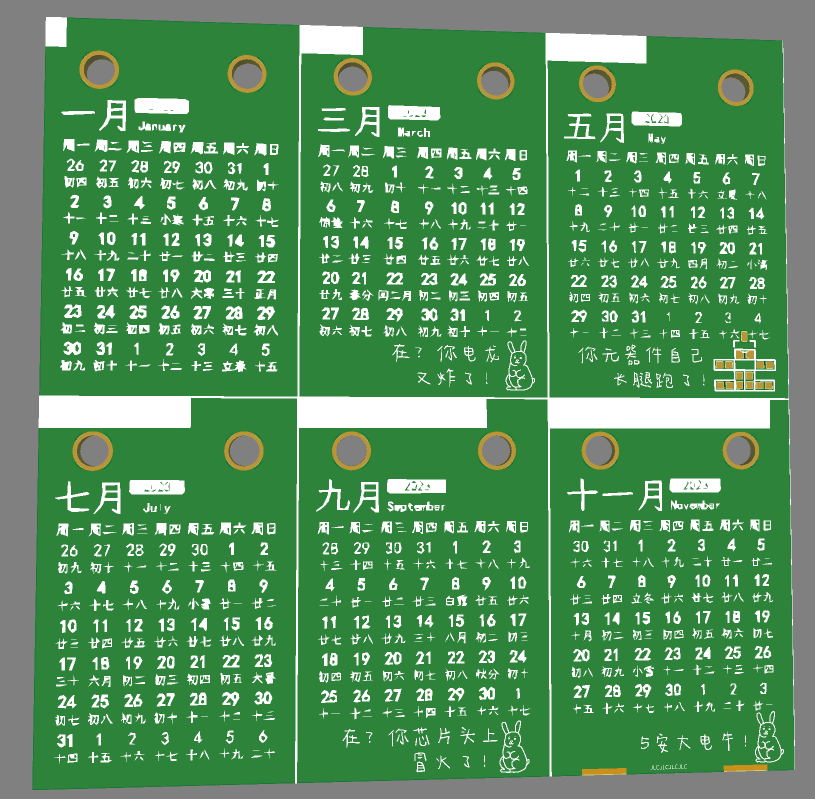
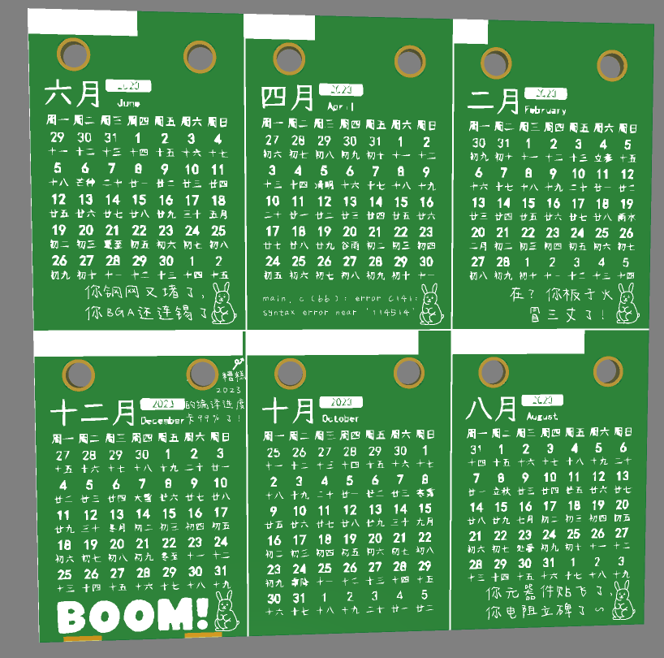

# PCB月历 (2023)

(本文不会刻意区分 "日历" 和 "月历" 两个概念, 把它们都理解成 "月历" 就行)

**PCB源文件开源在立创开源硬件平台:** [https://oshwhub.com/duckburnincense/2023-calendar](https://oshwhub.com/duckburnincense/2023-calendar)

**其余文件** (用到的月历生成程序、图片、字体文件等) **开源在GitHub:** [https://github.com/DuckBurnIncense/2023-calendar-pcb](https://github.com/DuckBurnIncense/2023-calendar-pcb)

## 为什么我要做这个月历

日常逛b站, 看到了这个

我没有, 然后我就

原因就是这么简单

## 实际效果

## 板子的3D图

## GitHub 开源的文件说明

- `/`
    - `calendar-images/` # 日历的图片. 直接在EDA软件里画日历太复杂, 还是写个程序生成图片再导入方便
    - `fonts/` # 用到的字体, 字体的版权声明会附在文末
    - `generate-calendar/` # 用来生成日历图片的程序, 随手写的, 比较乱 ~~(能用就行)~~
    - `images/`
        - `rabbit.png` # 我用 Windows 自带的 "画图" 软件随手画的兔子 ~~(灵魂画手)~~
        - `docs-image/` # 本文中用到的图片
    - `LICENSE` # 本项目的许可证 (MIT)
	- `README.md` # 就是你正在看的这个

---

本项目的许可证: MIT

字体文件的许可证及出处:
- `Kaph`: [SIL Open Font License 1.1](http://scripts.sil.org/cms/scripts/page.php?site_id=nrsi&id=OFL) | [字体文件出处](https://ggbot.itch.io/kaph-font)
- `今年也要加油鸭`: 允许个人和企业免费使用，包括商业用途，例如广告设计、电商平台等。除非有特殊说明，否则任何人不可修改该字体或制作衍生版本，不可直接将该字库作为商品出售，不可用于商标注册、出版物（比如书籍、字帖等）、嵌入式用途（比如软件、APP等），不可将这款字体应用于违反国家法律法规的任何场景。| [字体文件出处](https://www.100font.com/thread-334.htm)
